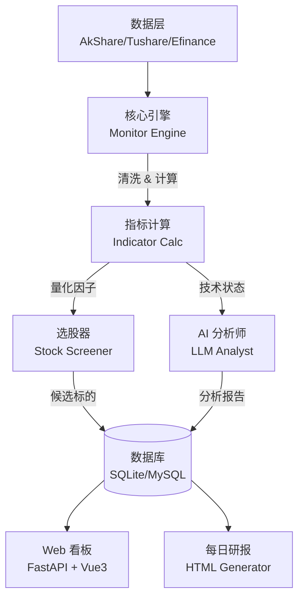

# A-Daily-Quant (A股量化决策系统)

<div align="center">
  
  
  
  
</div>

<div align="center">
  <h3>数据驱动决策 · AI 赋能交易 · 严守风控纪律</h3>
</div>

---

## 📖 项目简介

**A-Daily-Quant** 是一个专为 A 股市场打造的现代化量化决策系统。它不仅仅是一个选股工具，更是一个集成了**数据清洗**、**量化分析**、**AI 深度解读**与**实时风控**的完整交易辅助平台。

区别于传统的量化框架，本项目深度融合了 **LLM (大语言模型)** 能力，能够像专业投顾一样，结合技术指标与市场情绪，为你提供有逻辑、有温度的交易建议。

## ✨ 核心特性

*   **🧠 AI 智脑 (Agent Analyst)**: 集成 OpenAI/Gemini/DeepSeek 等大模型，对持仓和标的进行深度复盘与预测。
*   **📊 量化筛选 (Quant Screener)**: 基于“趋势跟踪 + 资金共振”逻辑，每日自动扫描全市场，捕捉强势股。
*   **🛡️ 动态风控 (Risk Shield)**: 独创 Beta Shield 风控模型，根据大盘环境动态调整仓位建议，在大跌前强制空仓。
*   **📡 实时雷达 (Real-time Monitor)**: Web 可视化看板，实时监控自选股的量比、资金流向与盘口异常。
*   **📝 自动化研报 (Auto Report)**: 每日盘后自动生成精美的 HTML/Markdown 研报，复盘当日操作与明日计划。

## 🏗️ 系统架构



## 🚀 快速开始

### 1. 环境准备

确保系统已安装 Python 3.9+。

```bash
# 克隆项目
git clone https://github.com/yourusername/a-daily-quant.git
cd a-daily-quant

# 创建虚拟环境
python -m venv .venv
source .venv/bin/activate  # macOS/Linux
# .venv\Scripts\activate   # Windows

# 安装依赖
pip install -r requirements.txt
```

### 2. 配置说明

在项目根目录创建 `config.json`：

```json
{
  "api": {
    "provider": "openai",
    "base_url": "https://api.openai.com/v1",
    "api_key": "sk-xxxxxxxx",
    "model": "gpt-4-turbo"
  },
  "tushare": {
    "token": "YOUR_TUSHARE_TOKEN"
  },
  "monitor": {
    "watch_list": [
      {"symbol": "600519", "name": "贵州茅台"},
      {"symbol": "510300", "name": "沪深300ETF", "asset_type": "etf"}
    ]
  }
}
```

### 3. 运行系统

#### 🖥️ 启动 Web 监控台 (推荐)

```bash
./start_web.sh
```
访问: `http://127.0.0.1:8100`

#### 🤖 生成每日策略研报

```bash
python main.py --section all
```
研报将生成在 `reports/` 目录下。

## 📂 项目结构

| 目录/文件 | 说明 |
| :--- | :--- |
| `monitor_engine.py` | 核心监控与调度引擎 |
| `stock_screener.py` | 每日选股策略实现 |
| `llm_analyst.py` | AI 深度分析模块 (LLM) |
| `web_server.py` | Web 后端 (FastAPI) |
| `frontend/` | Web 前端源码 (Vue3) |
| `strategies/` | 具体的量化策略逻辑 |
| `reports/` | 自动生成的研报存档 |

## ⚠️ 免责声明

本项目仅供技术研究与学习交流使用。**市场有风险，投资需谨慎**。项目中的任何策略或分析结果均不构成投资建议。

---
*Powered by A-Daily-Quant Team*
