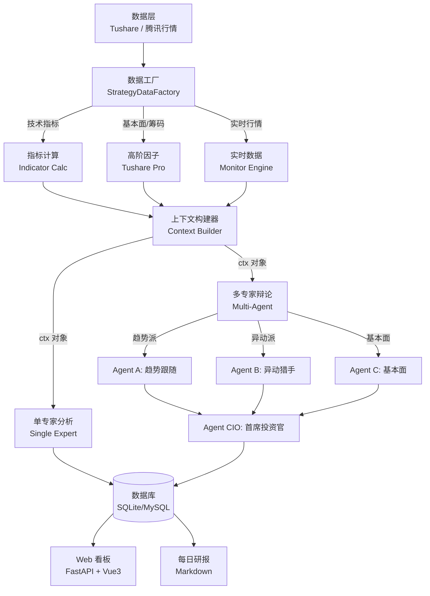

# A-Daily-Quant (A股量化决策系统)

<div align="center">
  
  
  
  
</div>

<div align="center">
  <h3>简单高效 · 个人量化 · A股市场</h3>
</div>

---

## 📖 项目简介

**A-Daily-TradingAgents** 是一个轻量化的、更适合个人定制化使用的、专为 A 股市场打造的现代化量化决策系统。它不仅仅是一个选股工具，更是一个集成了**数据清洗**、**量化分析**、**AI 深度解读**与**实时风控**的完整交易辅助平台。

区别于传统的量化框架，本项目深度融合了 **LLM (大语言模型)** 能力，能够像专业投顾一样，结合技术指标与市场情绪，为你提供有逻辑、有温度的交易建议。

## 核心特性

*   **多专家 AI 辩论 (Multi-Agent Debate)**: 内置"趋势跟随者 / 异动猎手 / 基本面研究员 / 首席投资官"四大专家角色，通过辩论博弈产出高质量分析报告。
*   **统一上下文工厂 (Strategy Data Factory)**: 一次性准备所有上下文数据（技术面、基本面、筹码分布、资金流向），确保 Prompt 数据完整性。
*   **量化筛选 (Quant Screener)**: 基于"趋势跟踪 + 资金共振"逻辑，每日自动扫描全市场，捕捉强势股。
*   **动态风控 (Risk Shield)**: 独创 Beta Shield 风控模型，根据大盘环境动态调整仓位建议，在大跌前强制空仓。
*   **实时雷达 (Real-time Monitor)**: Web 可视化看板，实时监控自选股的量比、资金流向与盘口异常。
*   **自动化研报 (Auto Report)**: 每日盘后自动生成精美的 HTML/Markdown 研报，复盘当日操作与明日计划。
*   **零配置启动**: 内置 SQLite 数据库，开箱即用无需任何外部依赖，同时兼容 MySQL 等外置数据库。

##  运行截图

### 选股页面


### 多Agent分析


### Agent助手Prompt模板配置


##  系统架构


```mermaid
graph TD
    Data[数据层<br>Tushare / 腾讯行情] --> Factory[数据工厂<br>StrategyDataFactory]
    Factory --> |技术指标| Calculator[指标计算<br>Indicator Calc]
    Factory --> |基本面/筹码| Extra[高阶因子<br>Tushare Pro]
    Factory --> |实时行情| RT[实时数据<br>Monitor Engine]
    
    Calculator --> Context[上下文构建器<br>Context Builder]
    Extra --> Context
    RT --> Context
    
    Context --> |ctx 对象| SingleAI[单专家分析<br>Single Expert]
    Context --> |ctx 对象| MultiAI[多专家辩论<br>Multi-Agent]
    
    MultiAI --> |趋势派| AgentA[Agent A: 趋势跟随]
    MultiAI --> |异动派| AgentB[Agent B: 异动猎手]
    MultiAI --> |基本面| AgentC[Agent C: 基本面]
    AgentA --> CIO[Agent CIO: 首席投资官]
    AgentB --> CIO
    AgentC --> CIO
    
    SingleAI --> DB[(数据库<br>SQLite/MySQL)]
    CIO --> DB
    
    DB --> Web[Web 看板<br>FastAPI + Vue3]
    DB --> Report[每日研报<br>Markdown]
```

## 🚀 快速开始 (开箱即用)

本项目已实现**零配置/零中间件**的极简启动，彻底移除了对 MySQL/Redis 的强制依赖。

### 1. 克隆代码

```bash
git clone https://github.com/yongqiu/A-Daily-Quant.git
cd A-Daily-Quant
```

### 2. 一键启动向导

为了避免与其他项目的依赖冲突，**强烈建议**在虚拟环境中运行。

确保系统已安装 **Python 3.9+**，在项目根目录依次执行：

```bash
# 创建虚拟环境 (选做但推荐)
python -m venv .venv
source .venv/bin/activate  # macOS/Linux
# .venv\Scripts\activate   # Windows

# 安装依赖
pip install -r requirements.txt

# 确保已进入虚拟环境，一键启动
python start.py

# 启动后访问http://127.0.0.1:8100 打开web UI 界面
```

### 2. 配置说明

1. 拷贝配置文件
cp config.json.example config.json

2. 配置大模型api和tushare的个人token
```json
{
  "data_source": { 
    "provider": "tushare",
    "tushare_token": "your-tushare-token"
  },
  "api": {
    "provider": "deepseek"
  },
  "api_deepseek": {
    "provider": "deepseek",
    "api_key": "your-token",
    "base_url": "https://api.deepseek.com/v1",
    "model": "deepseek-chat"
  }
}

```

`start.py` 会自动完成：环境检查、依赖安装、**交互式生成配置文件**、初始化数据库、并最终拉起 Web 看板。

#### 3. 手动配置 (进阶)

如果您更倾向于手动管理配置，或需要使用 MySQL 数据库，请执行：

1. **复制示例文件**：
   ```bash
   cp config.json.example config.json
   ```
2. **编辑配置**：
   使用编辑器打开 `config.json`，根据注释填入你的 `tushare_token` (数据获取) 以及 `api_key` (LLM 支持)。
   
   ps:强烈建议使用tushare的pro接口，如果没有也没关系，会降级到akshare获取免费的行情数据
3. **数据库声明**：
   - 默认使用 `sqlite`：无需任何操作。
   - 使用 `mysql`：需在 `database` 字段中将 `type` 改为 `mysql` 并填入相关地址。

---

> **进阶提示**: 您可以随时修改 `config.json` 来切换不同的 LLM 通道（支持 DeepSeek, Gemini, OpenAI 等）。

#### 🤖 生成每日策略研报 (CLI模式)

当您在看板调参完毕后，可以一键生成静态报告：

```bash
python main.py --section all
```
研报将生成在 `reports/` 目录下。


## 📂 项目结构

| 目录/文件 | 说明 |
| :--- | :--- |
| `start.py` | 一键启动向导（环境检查、依赖安装、数据库初始化） |
| `strategy_data_factory.py` | **统一数据工厂**（多级缓存，一次性准备所有分析上下文） |
| `context_builder.py` | 上下文构建器（将散落数据清洗封装为 Prompt 友好的 ctx 对象） |
| `llm_analyst.py` | AI 深度分析模块（支持 OpenAI/Gemini/DeepSeek，Jinja2 模板驱动） |
| `agent_analyst.py` | 多专家辩论系统（Multi-Agent Debate 调度器） |
| `monitor_engine.py` | 核心监控与调度引擎 |
| `stock_screener.py` | 每日选股策略实现 |
| `web_server.py` | Web 后端 (FastAPI，SSE 流式推送) |
| `database.py` | 数据库抽象层（SQLite / MySQL 自动适配） |
| `data_fetcher.py` | 数据获取调度器 |
| `data_fetcher_ts.py` | Tushare Pro 数据源（高阶因子、筹码分布、财务指标） |
| `frontend/` | Web 前端源码 (Vue3 + Vite) |
| `reports/` | 自动生成的研报存档 |

## ⚠️ 免责声明

本项目仅供技术研究与学习交流使用。**市场有风险，投资需谨慎**。项目中的任何策略或分析结果均不构成投资建议。

---
*Powered by A-Daily-Quant Team*
